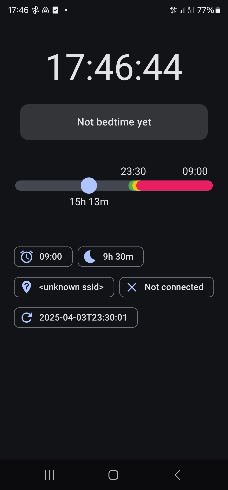
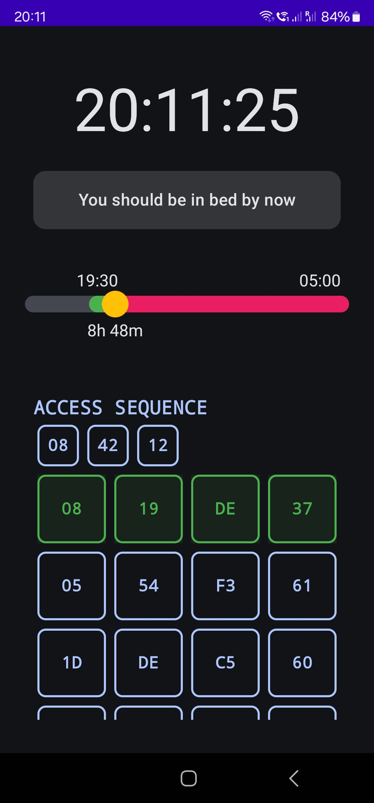

# GoSleep

GoSleep is a smart bedtime reminder app that's perseverant enough to make me go to sleep :)  

|                      Main Screen                      |                   Remainder Screen                    |
|:-----------------------------------------------------:|:-----------------------------------------------------:|
|  |  |

## Features

- **Smart Bedtime Zones**: Visual indication of your current bedtime status:
  - 🟢 **Green Zone**: Time to get ready for bed
  - 🟡 **Yellow Zone**: You should be in bed by now
  - 🔴 **Red Zone**: You're significantly past bedtime

- **Customizable Sleep Schedule**:
  - Set your desired wake-up time
  - Configure your ideal sleep duration
  - Adjust zone durations to match your personal wind-down routine

- **Home Detection**:
  - Automatically detects when you're at home via Wi-Fi network or geofencing
  - Set a specific location on a map to define your home area
  - Only sends bedtime reminders when you're at home
  - Works with either Wi-Fi or location (OR condition)

- **Charging Detection**:
  - Monitors if your device is charging
  - Assumes you're sleeping if your device is charging during bedtime hours
  - Skips alarms when charging at bedtime (you're likely already asleep)

- **Engaging Alarm Dismissal**:
  - Solve a small puzzle to dismiss the alarm
  - Ensures you're actually awake before turning off the reminder

- **Persistent Notifications**:
  - Full-screen alerts that can appear even when your device is locked
  - Gradually increasing reminder frequency as bedtime zones progress

## How It Works

1. **Set Your Schedule**: Configure your wake-up time and desired sleep duration
2. **Zone Monitoring**: The app calculates your ideal bedtime and creates three zones:
   - Green Zone: The initial period when you should start preparing for bed
   - Yellow Zone: When you should be in bed
   - Red Zone: When you're significantly past your ideal bedtime
3. **Smart Reminders**: 
   - Reminders only trigger when you're at home (connected to your home Wi-Fi or within your defined geofence area)
   - If your phone is charging during bedtime hours, the app assumes you're sleeping and won't disturb you
   - Reminders become more frequent as you progress through the zones

## Installation

1. Clone the repository
2. Open the project in Android Studio
3. Configure the Google Maps API key (see below)
4. Build and install on your Android device

## Google Maps API Key

The app uses Google Maps for geofencing functionality. To use this feature, you need to obtain a Google Maps API key:

1. Go to the [Google Cloud Console](https://console.cloud.google.com/)
2. Create a new project or select an existing one
3. Enable the following APIs:
   - Maps SDK for Android
4. Create credentials to get your API key
5. Add the API key to your `local.properties` file:
   ```
   MAPS_API_KEY=your_api_key_here
   ```

> **Note**: Never commit your API key to version control. The `local.properties` file is already in `.gitignore`.

## Requirements

- Android 8.0 (API level 26) or higher
- Permissions:
  - Location (for Wi-Fi network detection and geofencing)
  - Notifications
  - Alarm scheduling
  - Background execution

## Technologies Used

- Kotlin
- Jetpack Compose for UI
- Kotlin Coroutines and Flow for reactive programming
- Android Alarm Manager for scheduling
- Notifications API for alerts
- Google Maps API for geofencing
- Google Play Services Location API for geofence monitoring

## License

This project is licensed under the Apache License 2.0 — see the [LICENSE](LICENSE) file for details.
